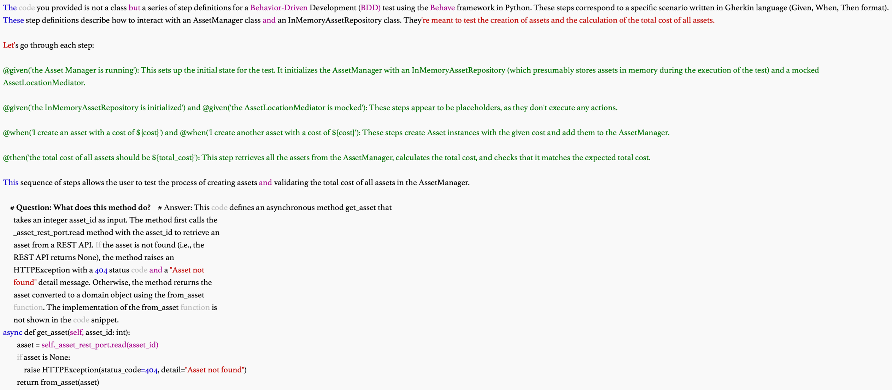

## Al-Powered Developer: Build software with ChatGPT and Copilot

by Nathan Crocker

https://github.com/nathanbcrocker/ai_powered_developer

### Part 1. The foundation

LLMs are deep learning models that are good at providing natural language responses to natural language prompts. 

If you are interested in diving deeper into the theory behind LLMs, neural networks, and all things generative AI, you should look at the following two books: the forthcoming Build a Large Language Model (From Scratch) by Sebastian Raschka (Manning, 2024) and the amusingly titled The Complete Obsolete Guide to Generative AI by David Clinton (Manning, 2024).

Most LLMs use the Transformer architecture, a deep learning model that relies on self-attention mechanisms to weigh the importance of different words in a sentence regardless of their position. This allows LLMs to generate more contextually relevant text. A typical Transformer model consists of an encoder and a decoder, each composed of multiple layers.

This is known as the **Refinement Pattern** in prompt engineering: iteratively refining or improving the prompt to get more accurate, relevant, or sophisticated responses.

The second part of the prompt introduces a prompting pattern we will see throughout this book: **the Persona Pattern.** In the context of prompt engineering, mainly related to AI and LLMs, the Persona Pattern refers to a strategy of designing prompts that establish a specific persona or role for the AI to assume. This approach guides the model’s responses consistently and contextually appropriately. One of the key benefits of using the Persona Pattern is maintaining consistency in responses. Adhering to a defined persona makes the AI’s replies more predictable and aligned with the user’s expectations. In this case, we have asked ChatGPT to assume the persona of an intern with a background in computer science. Why an intern? We want a persona who will do the work.

Comparing ChatGPT, Copilot, and CodeWhisperer: The first dimension we will consider is the engagement model: how we engage with AI. 

### Part 2. The input

We will explore more of the features of an ITAM system, building a solid conceptual model of the application with a focus on a system that can track and manage hardware. Next, let’s ask ChatGPT to assume the software architect persona, solicit its opinion about how best to design this project, and see what solution it can come up with.

##### Hexagonal architecture

Hexagonal architecture, also known as the Ports and Adapters Pattern, is an architectural pattern that aims to create a clear separation between an application’s core logic and its interaction with external systems, such as databases, user interfaces, and third-party services. This separation of concerns helps to achieve a more maintainable, flexible, and testable application.

The main components of hexagonal architecture are as follows:
- Domain model—The core business logic of the application, including entities, value objects, and domain services. The domain model is isolated from any external systems or technologies and should not depend on any implementation-specific details like databases or APIs.
- Ports—Interfaces that define the contract between the domain model and the external systems. They represent the input and output boundaries of the application. There are two types of ports: primary and secondary.
    - Primary (driven) ports—Define the use cases that the application exposes to the external systems. They represent the API that external systems can use to interact with the application.
    - Secondary (driving) ports—Define the contracts that the application expects from external systems, like data repositories or external services.
- Adapters—The implementations of the ports. Adapters handle communication between the domain model and the external systems, converting the data and protocols used by external systems into a format the domain model can understand. There are two types of adapters: primary and secondary.
    - Primary (driven) adapters—Implement the primary ports and are responsible for receiving input from external systems and passing it to the domain model. 
    - Secondary (driving) adapters—Implement the secondary ports and are responsible for interacting with external systems on behalf of the domain model. 

In hexagonal architecture, the domain model is at the center (the “hexagon”), surrounded by the ports and adapters. The key idea is that any interaction between the domain model and external systems must pass through the ports and adapters. This architecture allows for easy swapping of external systems, simplified testing by using mock implementations of ports, and clear separation of concerns, promoting a more maintainable application.

##### SOLID design

S: Single responsibility principle (**SRP**)
O: Open/Closed principle (**OCP**)
L: Liskov substitution principle (**LSP**)
I: Interface segregation principle (**ISP**)
D: Dependency inversion principle (**DIP**)

SOLID stands for five software development design principles intended to make software designs more flexible and maintainable:
- SRP states that a class should have only one reason to change. A class should have only one job, and it should do it well.
- OCP states that software entities (classes, modules, functions, etc.) should be open for extension but closed for modification.
- LSP states that objects of a superclass should be replaceable with objects of a subclass without affecting the correctness of the program. What works with a superclass should also work with its subclasses.
- ISP states that a client should not be forced to depend on methods it does not use. It’s better to have small interfaces than big ones.
- DIP states that high-level modules should not depend on low-level modules. You should program to interfaces, not implementations.

##### The Visitor Pattern

##### Business requirements document

A BRD is a formal document that outlines the high-level requirements, features, and constraints of a project. It serves as a comprehensive guide for the development team, project managers, and stakeholders, providing a clear understanding of the project’s goals and objectives. A BRD typically includes the following sections:
1. Introduction—Outlines the purpose and scope of the document.
2. Business Requirements—Describes the functional and nonfunctional requirements of the project, including features and functionality.
3. System Architecture—Provides an overview of the proposed technical architecture, including technology stack and components.
4. Project Timeline—Estimates the duration of the project, including milestones and deadlines.
5. Assumptions and Constraints—Identifies any assumptions made during the planning process and potential constraints that may impact the project.
6. Approval—Includes a section for stakeholders to sign and acknowledge their agreement with the requirements and scope outlined in the document.

##### The C4 model

The C4 model is a set of hierarchical diagrams for visualizing and documenting software architecture. C4 stands for context, containers, components, and code, which are the four levels of abstraction in the model:
- Context—This level illustrates the system’s overall context, showing how it interacts with its users and other systems. It provides a high-level view of the system and its environment.
- Containers—This level focuses on the system’s primary containers (e.g., web applications, databases, and microservices) and how they interact. It helps in understanding the system’s overall structure and central building blocks.
- Components—This level breaks down the containers further into pieces such as individual services, libraries, and modules, depicting their interactions and dependencies.
- Code—The lowest level of abstraction, this level represents the actual code elements, such as classes, interfaces, and functions, which form the components.

The C4 model is helpful for understanding and communicating the architecture of a software system at various levels of abstraction, making it easier for developers, architects, and stakeholders to collaborate and discuss the system’s design.

##### Summary 3

ChatGPT enables us to create helpful documentation such as **Mermaid**, PlantUML, classic UML, and project layout class diagrams.

**Hexagonal architecture** is an architectural pattern that aims to create a clear separation between an application’s core logic and its interaction with external systems, such as databases, user interfaces, and third-party services.

The five **SOLID** software development design principles are intended to make software designs more **flexible and maintainable**. They include the single responsibility principle, the open/closed principle, the Liskov substitution principle, the interface segregation principle, and the dependency inversion principle.

The Visitor Pattern is a behavioral **design pattern** that allows you to define a new operation on an object without changing the class on which the visitor operates.

ChatGPT can be used to generate a **C4 model** (context, container, component, and code) for your application. The C4 model provides a way to **drill into the design of the system**.

ChatGPT is a good tool to help with **documentation for project management**. It can provide estimates of time and materials for the completion of development, and it can create a series of tasks based on the project’s milestones against which you can track the progress of development.

### Part 3. The feedback

These include unit tests, integration tests, and behavior tests. To start, we will use Copilot Chat to help us create a unit test.

unittest provides a rich set of assertions and is great for writing simple to complex test cases, but it can be verbose.

Behavioral testing focuses on defining the behavior of the software in terms of user stories or scenarios. These scenarios are written in a specific format called given-when-then (GWT) and are used to drive the development process. The GWT format describes the preconditions (given), the actions (when), and the expected outcomes (then) of a particular scenario.

This section delves into the fascinating and intricate domain of software quality metrics—the quantitative standards and benchmarks that guide our understanding of the quality of a software system:
1. Definition Cyclomatic complexity is a metric that quantifies the number of independent paths through a software module. It measures the complexity of decision-making in the code, including loops, conditionals, and branches. A higher cyclomatic complexity value indicates increased complexity and suggests the potential for more bugs and challenges in understanding and maintaining the code.
2. Definition Halstead complexity measures assess the complexity of a software program based on the number of unique operators and operands used in the code. These measures include metrics such as program length (N1), program vocabulary (n1), volume (V), difficulty (D), effort (E), and others. These metrics provide insights into the size and cognitive complexity of the code.
3. Definition The maintainability index is a composite metric that combines several factors, including cyclomatic complexity, lines of code, and Halstead complexity measures, to provide an overall measure of software maintainability. A higher maintainability index suggests easier maintenance and potentially lower complexity.

> Copilot Chat explaining the behavior test we wrote earlier

Summary
- Unit testing focuses on testing individual components or units of code to identify bugs and problems in specific units. Unit tests will be the most numerous in your codebase.
- Integration testing tests the interaction between different components or modules of the software to ensure seamless integration and detect communication problems.
- Behavior testing tests a system’s functionality from an end user’s perspective, ensuring that it meets requirements and specifications.
- Mock objects simulate the behavior of natural objects in a controlled way and are useful for testing and simulating error conditions. Mock objects are especially good at mimicking parts of the system that are needed for the test to run but are outside the scope of the test: for example, if your class has a constructor argument for a database, but you do not want to test the database directly because the data may change, causing your test to be inconclusive, nonrepeatable, or nondeterministic.
- Cyclomatic complexity measures the number of independent paths through a software module, indicating complexity and potential for bugs.
- Halstead complexity measures assess software complexity based on unique operators and operands, providing insights into code size and cognitive complexity.
- The maintainability index combines factors like cyclomatic complexity, lines of code, and Halstead measures to evaluate software maintainability.
- Code coverage is a metric for evaluating test effectiveness, indicating the extent to which code is tested and the potential for uncaught bugs. Generally, higher is better.

### Part 4. Into the world

Fortunately, Copilot can write **Helm charts** for you as well!

NOTE This discussion of Terraform is heavily abridged. When you are ready to get serious with Terraform, your go-to resource should be Scott Winkler’s Terraform in Action (Manning, 2021; www.manning.com/books/terraform-in-action).

You learned about the transition from application development to product launch, covering deployment strategies, best practices for cloud infrastructure, and the use of Docker and Terraform for managing and containerizing applications efficiently.

You’ve learned how to use ChatGPT’s knowledge to identify potential threats, evaluate threat scenarios, pinpoint vulnerabilities, and assess application designs against best practices.

Let’s focus on another LLM we can run locally: GPT-4All
